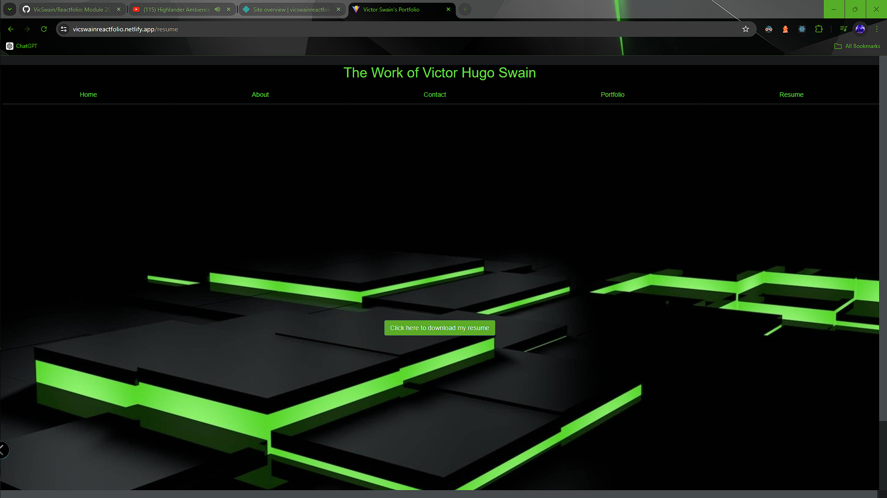

  # Reactfolio

  ## Description
  This is my portfolio created using React. This is a single page application with a static navigation bar and footer. The nav bar will direct to user to respective pages of the site, and the footer contains direct social links. When reaching the landing page, the navigation will contain tabs for "About Me" "Portfolio" "Contact Me" and "Resume" Each page will have correspondion sections, and the selcted tab's view differs from the remaining tabs.The contact from has field for a name, email address, and message to send to me. The resume section has a button to download my resume. The about me and portfolio section provide the view with some insight to me. 

  ## Table of Contents
  [Installation](#installation)

  [Usage](#usage)

  [License](#license)

  [Contributors](#contributors)

  [Tests](#tests)

  [Questions](#questions)

  ## Installation
  npm install

  ## Usage
  npm run dev  
  [CHECK IT OUT!](https://vicswainreactfolio.netlify.app/)

  ## Screenshots
  
  
  

  ### Questions
  [GIT AT ME!](https://github.com/VicSwain)
  [REACH ME](@huracanmusic2016@gmail.com)

  #### Contributors
  N/A
  #### Tests
  N/A

  #### License 
  No license

